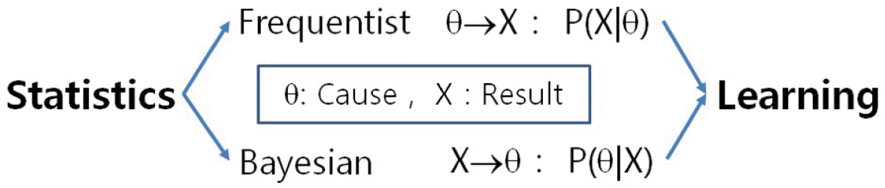

# Beyond Bayesians and Frequentists

## Introduction

Andrew Ng (founder Google Brain, former head of Baidu AI group) says that anyone is qualified for a career in Machine Learning after learning basic principles of maths, stats and computation that is involved in ML. After finishing your course in Data science, how would you continue to learn about the latest trends and approaches in the field of analytics to keep your skills up to date ? Well, you read good reference books, but at times this may become a bit hard as most of the books would covered a breadth of topics and may require you to put a lot of time into reading. In order to become self sufficient in this domain, you read essays, articles, review papers, technical papers etc. Andrew Ng says that after you have completed some ML related courses.. 

> “to go even further, read papers. Even better, (with technical papers) try to replicate the results in the papers.”

In this context, for this lesson you are required to read a non technical essay "**Beyond Bayesians and Frequentists**" by [Dr. Jacob Steinhardt](https://cs.stanford.edu/~jsteinhardt/) from Stanford University, Statistics Department.  This would help you have a deeper understanding of two forms of estimations that we have seen so far in our course.

## Objectives

You will be able to:
* Develop a strong theoretical perspective on the applications of Frequentist and Bayesian estimation techniques 

## Essay Summary 

- The essay can be downloaded [HERE](https://cs.stanford.edu/~jsteinhardt/stats-essay.pdf). 

The essay starts by providing a background on Bayesian and Frequentist approaches and arguments that usually come up while debating these approaches. Before diving any further into these arguments, the author provides a summary recap of the two approaches and sets up grounds for further debate. The essay provides common justifications for using these approaches and then critically analyzes when these approaches might fail in a practical analytical context. 

The essay concludes with Author's opinions on how and when to use these methods to best exploit their potential. Following image highlights the key idea of how these approaches differ.

It is a simple essay (around 5 pages) and you should be able to read it within an hour. The paper is written in a non technical language for students like yourselves, just getting started with machine learning. Keen students are advised follow other papers from the reference list at the end. You dont have to do this all in one day, but we expect you to develop a habit around reading experts' opinions and practitioners' approaches around the techniques and algorithms you see for Machine Learning and Deep Learning to keep up with the fast pace of growth and development in these fields. 

## Summary

Congratulations, you've reached the end of this section!
